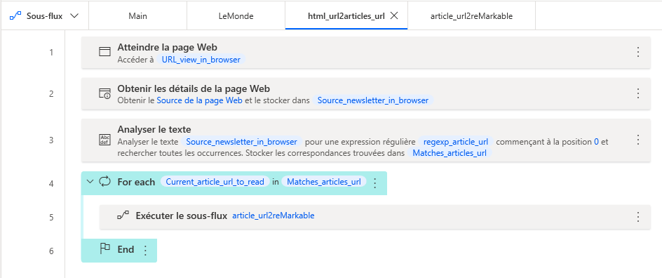

# newsletter2reMarkable
Power automate desktop flow to scrap email, and then to send articles found to reMarkable tablet using read on remarkable service.

📬 :arrow_right: :newspaper: :arrow_right: 📖

## Requirements

### :bulb: Legend
- [x] Mandatory
- [ ] Optionnal

### Hardware

- [x] [reMarkable tablet](https://remarkable.com/)
- [x] Microsoft Windows 10 (or higher) compatible computer

### Account

- [x] [reMarkable account](https://my.remarkable.com/) with [connect plan](https://my.remarkable.com/subscriptions) (or any equivalent plan which includes *read on remarkable* service)
- [x] Microsoft account (personnal, school or entreprise)
- [ ] Office 365 Subscription, see [alternatives](https://github.com/ronan-deshays/newsletter2reMarkable#alternatives)
- [ ] LeMonde Abonnés (paid subscription)

### Desktop app

- [x] Microsoft Power Automate Desktop (free / basic version, noted PAD in this doc) : [Microsoft Store](https://www.microsoft.com/p/power-automate/9nftch6j7fhv) [Standalone installer](https://www.microsoft.com/store/productId/9NFTCH6J7FHV)
- [x] Web browser compatible with all addons below. :warning: UWP Mozilla Firefox not working
- [ ] Outlook 2019 (or 365 or higher) Desktop app, see [alternatives](https://github.com/ronan-deshays/newsletter2reMarkable#alternatives)
 
### Web browser addon

- [x] Power Automate (automatically installed on Edge when PAD is installed) : [Mozilla Firefox](https://addons.mozilla.org/firefox/addon/power-automate-desktop/), [Microsoft Edge]
- [x] Read on reMarkable : [Firefox](https://addons.mozilla.org/firefox/addon/unofficial-remarkable) 1. 2.,  [Edge and Chrome](https://chrome.google.com/webstore/detail/read-on-remarkable/bfhkfdnddlhfippjbflipboognpdpoeh) 3.

1. :warning: Unofficial version, source code available on [GitHub](https://github.com/jelleschutter/remarkable-firefox)
2. :warning: Firefox from Microsoft Store is **not** detected by PAD, including when addon is installed. Use instead [legacy Firefox installer](https://www.mozilla.org/firefox/new/)
3. 💡 This Chrome plugin is compatible with the chromium version of Edge

## How it works

*Please note that PAD programmation is self explanatory. The main process is here quickly described, but you can import code in PAD for further informations.*

1. Instantiate Edge and Outlook in [Main](flow_and_subflows/Main.txt) flow
2. Launch every subflow (one for each type of newsletter, see [Supported newsletter types](https://github.com/ronan-deshays/newsletter2reMarkable#supported-newsletter-types) section) one after another, currently only [LeMonde](flow_and_subflows/LeMonde.txt) subflow is provided.

### For each newsletter subflow

4. Get emails based on criteria to customize depending on the needs of the end user and structure of newsletter. E.g. for LeMonde : 
   - get a link which enables to view newsletter in browser, in subflow [LeMonde](flow_and_subflows/LeMonde.txt)
   - iteratively collect every link which refers to an article, in subflow [html_url2articles_url](flow_and_subflows/html_url2articles_url.txt)
5. Send every article collected to remarkable by opening the article's link and clicking the read on remarkable extension button [article_url2reMarkable](flow_and_subflows/article_url2reMarkable.txt)

## Supported newsletter types

### Newspapers

#### LeMonde

[LeMonde](https://www.lemonde.fr/) is a french newspaper. A paid subscription to this newspaper gives access to premium articles and weekly and daily newsletter, which contains a few links to articles sorted by themes.

## How to use

1. Create a new PAD project
2. A Main (empty) flow is automatically created, create following subflows (one subflow for each .txt file in flow_and_subflow folder, except Main.txt) :
    - article_url2reMarkable
    - html_url2articles_url
    - LeMonde
3. Copy-paste text contained in each .txt file, in flow or subflow which has the same name
4. replace "*_here" parameter's values with the ones suitable with your credentials for the differents account mentionned upper.

You should obtain something similar to the screenshot below, except that PAD is in French in the screenshot.



## How to adapt to another newsletter

In your PAD project (follow [How to use](https://github.com/ronan-deshays/newsletter2reMarkable#how-to-use) section steps first) :
1. Create a new subflow with a name of your choice
2. Call this subflow in the Main flow
3. Adapt the ```regexp_article_url``` variable to your needs
4. Adapt the "View it in a web browser" parameter (e.g., for LeMonde, it is "Voir dans un navigateur"...) to your needs. It tells to PAD how to recognize the url which will be used to collect every article links.
 
## Alternatives

### Without Outlook and Office 365

PAD contains IMAP blocs, replace Outlook blocs with IMAP blocs and connect them to your mail service.

## Related projects

### Incomming

Custom [La Matinale du Monde](https://www.lemonde.fr/mobile/#appli-matinale) app, which gather informations from different sources and let the end user select articles to read using a Tinder-like interface.

## Disclaimer

This project is not affiliated with any of the companies mentionned on this repository.
